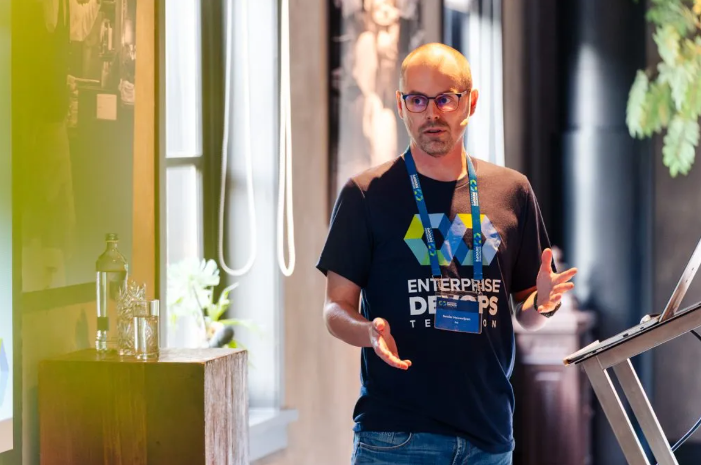

---
hide:
  - navigation
---

# About `harre.dev`

About me!

## Sander Harrewijnen

Hey, I'm a full-time software developer interested in a wide variety of technological topics with a special place for better software practices.

You can find out more about me here:

- [Github](https://github.com/harrewarre)
- [Mastodon](https://hachyderm.io/@harre)
- [LinkedIn](https://www.linkedin.com/in/sharrewijnen/)

### Appearances and other stuff

#### Enterprise DevOps TechCon 2023

This was the first edition of the <a href="https://enterprisedevopstechcon.nl">Enterprise DevOps TechCon</a> and I gave a talk about improving how software is made. It involved things like balanced team approach and variouspractices that sit around software development and can boost its impact.

#### VMUGNL 2023

Chistiaan Roeleveld and me [did a talk](https://vmugnl.nl/vmugnl-usercon-2023-agenda/#event-99) about how an organization can succeed with better development and platform practices at the Dutch VMWare User Group event. Christiaan shared his experience with platform engineering and I took a software development angle. Sadly there's no recording of it.

#### CapiCast

I was invited to take part in a podcast (in Dutch) about developer experience. Listen to it [here](https://open.spotify.com/episode/6OpaGuMm955ZYphyNdxRDI?si=806b4d81754844ab).
